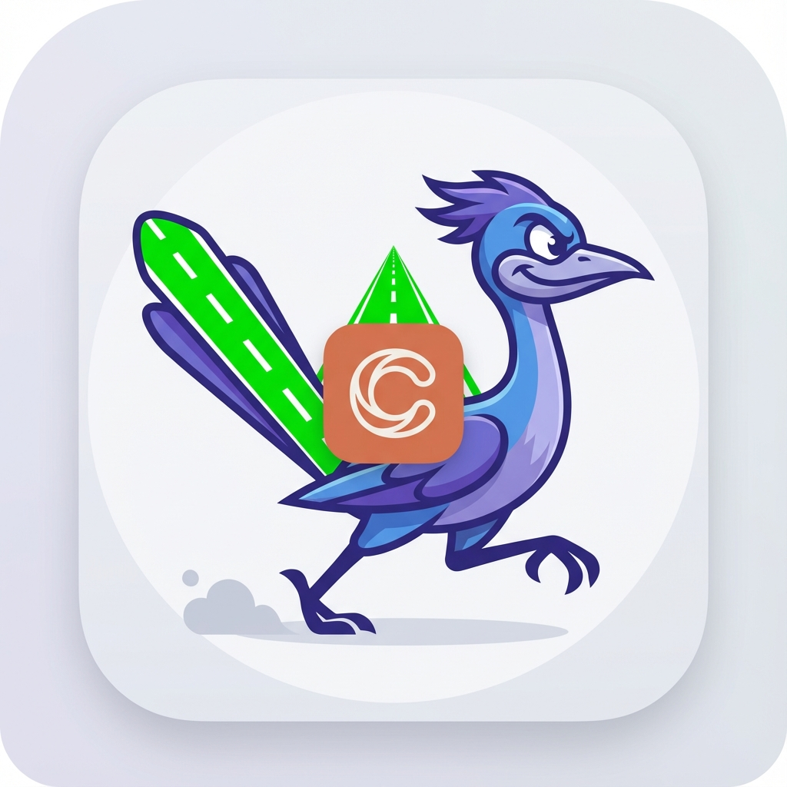

<p align="center">
  
</p>

# Fastlane Skill for Claude Code

[](LICENSE)
[](https://www.apple.com/macos/)
[](https://claude.ai/code)
[](https://fastlane.tools/)

> One command to set up Fastlane for iOS/macOS apps - from zero to App Store ready.

## Skills

| Skill | Description |
|-------|-------------|
| `/setup-fastlane` | Generate complete Fastlane configuration from Xcode project |
| `/beta` | Build and upload to TestFlight for beta testing |
| `/release` | Submit to App Store for review and production release |
| `/match` | Set up code signing certificate management |
| `/snapshot` | Automate App Store screenshot capture |

## What

Generates a complete Fastlane configuration by introspecting your Xcode project (extracts bundle ID, team ID, version from `.pbxproj`):

| Lane | Description |
|------|-------------|
| `test` | Run unit tests |
| `beta` | Build + upload to TestFlight |
| `release` | Submit TestFlight build to App Store |
| `lint` | Run SwiftLint |
| `ci` | Full CI workflow (lint → build → test) |
| `certificates_*` | Sync signing via `match` |

Plus: `Appfile`, `Matchfile`, `Deliverfile`, and metadata folder structure.

## Why

- **It's Nitrous oxide** - to super-charge your Fastlane setup/usage, so your focus is shipping
- **Zero config** - no manual entry of bundle IDs or team IDs
- **CI-ready** - optional [Xcode Cloud integration scripts](docs/xcode-cloud.md)

## How

**Prerequisites:** macOS with Xcode CLI tools, [Homebrew](https://brew.sh), and Fastlane (`brew install fastlane`)

### 1. Install the Skill

**Global Install** (available in all projects)

In Claude Code:
```
/plugin marketplace add greenstevester/fastlane-skill
```

Or via terminal:
```bash
curl -o ~/.claude/commands/setup-fastlane.md \
  https://raw.githubusercontent.com/greenstevester/fastlane-skill/main/skills/setup-fastlane.md
```

**Project-Only Install** (available only in current project)
```bash
mkdir -p .claude/commands
curl -o .claude/commands/setup-fastlane.md \
  https://raw.githubusercontent.com/greenstevester/fastlane-skill/main/skills/setup-fastlane.md
```

**Update to Latest Version**

Refresh the marketplace to pull latest changes:
```
/plugin marketplace update fastlane-skill
```

Or reinstall to get the latest:
```
/plugin uninstall fastlane-skill@fastlane-skill
/plugin install fastlane-skill@fastlane-skill
```

Then restart Claude Code to load the updated skills.

### 2. Run It

Navigate to your iOS/macOS project and run:

```
/setup-fastlane
```

### 3. Verify

```bash
fastlane lanes   # Lists: test, beta, release, lint, ci, certificates_*, etc.
```

### 4. Release Your App

**TestFlight Beta:**
```
/beta
```
Syncs certificates, increments build number, builds, and uploads to TestFlight.

**App Store Release:**
```
/release
```
Submits an existing TestFlight build to the App Store for review.

**Code Signing Setup:**
```
/match
```
Sets up Match for team certificate sharing via a private Git repo. Handles development, App Store, and ad hoc certificates.

**Automated Screenshots:**
```
/snapshot
```
Configures Snapshot to capture App Store screenshots across multiple devices and languages automatically.

## App Store Metadata

```bash
# Download existing metadata from App Store Connect
fastlane deliver download_metadata

# Push changes back
fastlane ios metadata
```

## CI/CD Integration

- **Xcode Cloud:** See [Xcode Cloud Setup Guide](docs/xcode-cloud.md)
- **GitHub Actions:** Coming soon

## Troubleshooting

| Issue | Solution |
|-------|----------|
| No Xcode project detected | Run from directory containing `.xcodeproj` or `.xcworkspace` |
| Bundle ID not found | Ensure project has `PRODUCT_BUNDLE_IDENTIFIER` set |
| Fastlane not found | Run `brew install fastlane` |
| Code signing errors | Run `/match` to set up certificate management |
| Screenshot capture fails | Ensure UI test target exists and `SnapshotHelper.swift` is added |

## Contributing

Issues and PRs welcome at [github.com/greenstevester/fastlane-skill](https://github.com/greenstevester/fastlane-skill).

## License

MIT
